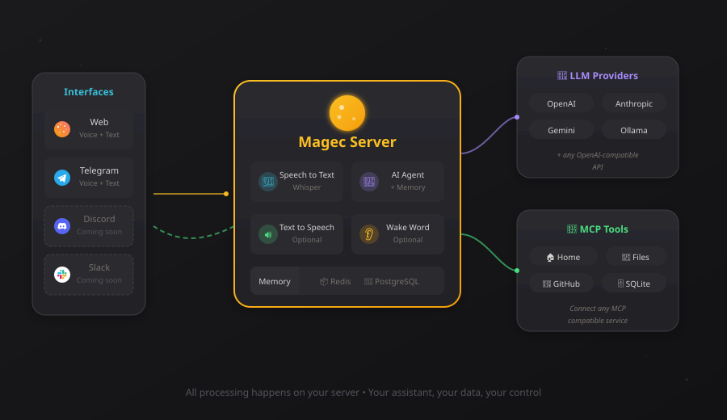
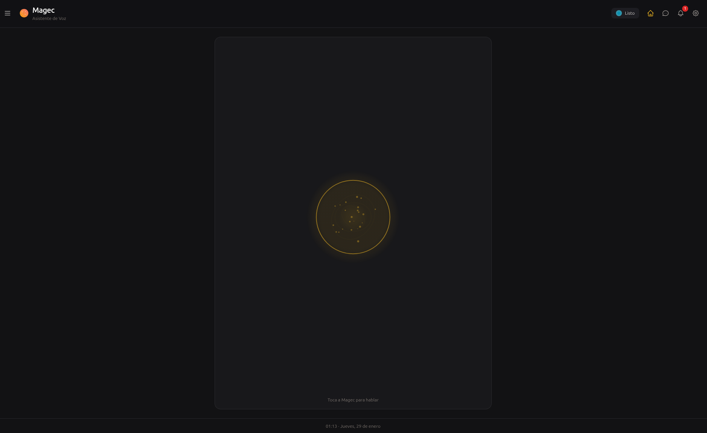
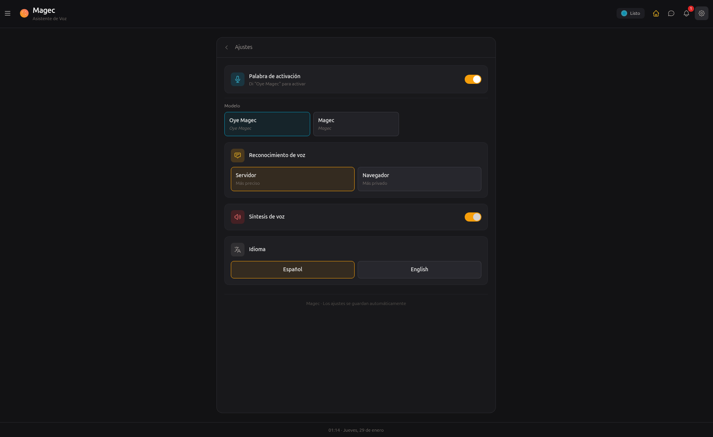
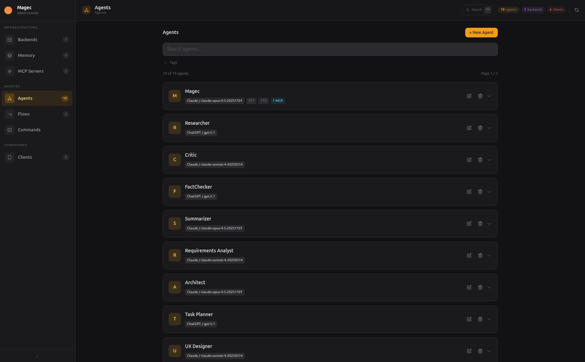
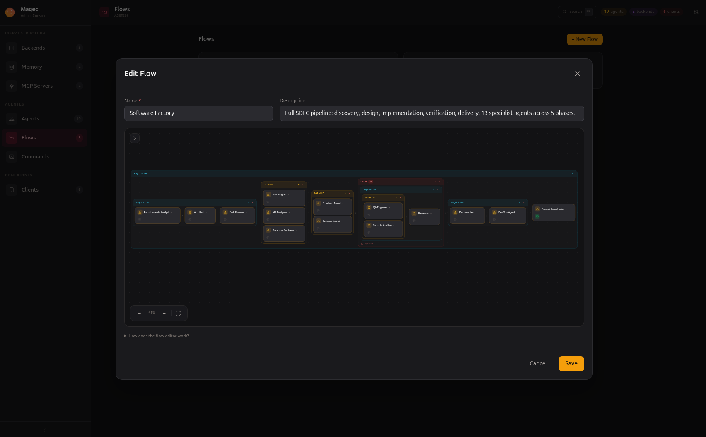
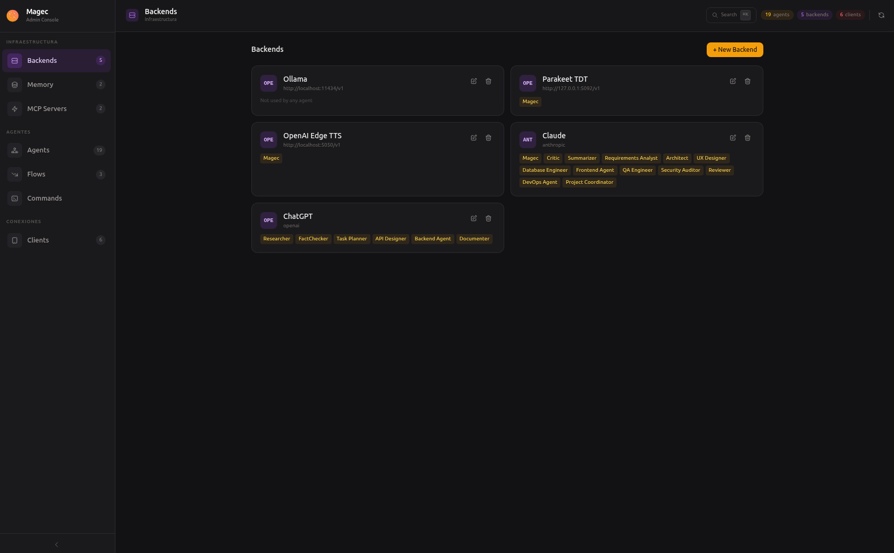
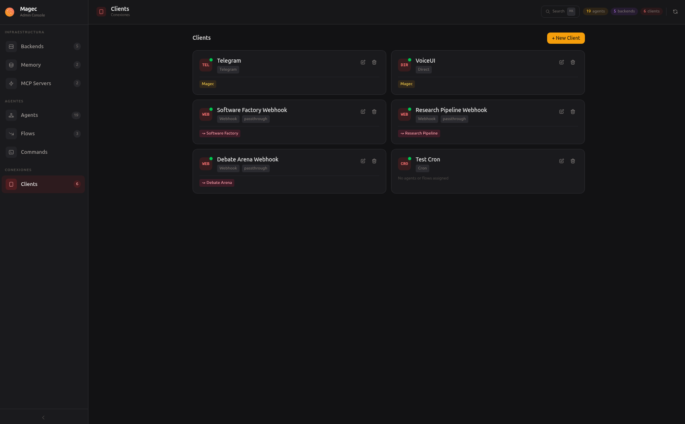

# Magec

<p align="center">
  
</p>

<p align="center">
  <strong>Self-hosted multi-agent AI platform with voice, visual workflows, and tool integration.</strong>
</p>

<p align="center">
  <a href="https://achetronic.github.io/magec">Website</a> ·
  <a href="https://achetronic.github.io/magec/docs.html">Docs</a> ·
  <a href="#quick-start">Quick Start</a>
</p>

---

Define multiple AI agents, each with its own LLM, memory, and tools. Chain them into multi-step workflows. Access via voice, Telegram, webhooks, or cron. Manage it all from a visual admin panel.

Your server, your data, your rules.

<p align="center">
  
</p>

## Quick Start

### Fully local (no API keys)

```bash
git clone https://github.com/achetronic/magec.git
cd magec/docker/compose/fully-local
docker compose up -d
```

### Cloud APIs

```bash
git clone https://github.com/achetronic/magec.git
cd magec/docker/compose/remote-openai
export OPENAI_API_KEY=sk-...
docker compose up -d
```

**Admin UI** → http://localhost:8081 · **Voice UI** → http://localhost:8080

## Highlights

- **Multi-agent** — Per-agent LLM, memory, voice, and tools. Hot-reload from the Admin UI.
- **Agentic Flows** — Visual drag-and-drop editor. Sequential, parallel, loop, nested.
- **Any backend** — OpenAI, Anthropic, Gemini, Ollama.
- **MCP tools** — Home Assistant, GitHub, databases, and hundreds more via Model Context Protocol.
- **Memory** — Session (Redis) + long-term semantic (PostgreSQL/pgvector).
- **Voice** — Wake word, VAD, STT, TTS. All server-side via ONNX Runtime.
- **Clients** — Voice UI, Admin UI, Telegram, webhooks, cron, REST API. Discord & Slack coming soon.
- **Store seeds** — Pre-populated configs for quick start (`MAGEC_SEED=voice-ui` or `examples`).

## Screenshots

### Voice UI

<p align="center">
  
  
  
  
</p>

### Admin UI

<p align="center">
  
  
</p>
<p align="center">
  
  
</p>

## Documentation

Full docs at **[achetronic.github.io/magec](https://achetronic.github.io/magec/docs.html)** — configuration, agents, flows, backends, memory, MCP tools, clients, API reference, and deployment.

## Development

### Requirements

- Go 1.21+
- Node.js (for Admin UI build)
- Docker (for infrastructure services)

### Make commands

| Command | Description |
|---------|-------------|
| `make build` | Build Admin UI + server binary |
| `make dev` | Build all and start server |
| `make dev-admin` | Start Admin UI dev server (Vite, hot-reload) |
| `make swagger` | Regenerate Swagger docs |
| `make infra` | Start PostgreSQL + Redis |
| `make ollama` | Start Ollama with qwen3:8b + nomic-embed-text |
| `make clean` | Remove build artifacts |

### Key dependencies

| Dependency | Purpose |
|------------|---------|
| [google.golang.org/adk](https://pkg.go.dev/google.golang.org/adk) | Google Agent Development Kit |
| [google/jsonschema-go](https://github.com/google/jsonschema-go) | JSON Schema generation for dynamic forms |
| [achetronic/adk-utils-go](https://github.com/achetronic/adk-utils-go) | ADK providers, session, memory |
| [modelcontextprotocol/go-sdk](https://github.com/modelcontextprotocol/go-sdk) | MCP client |
| [yalue/onnxruntime_go](https://github.com/yalue/onnxruntime_go) | ONNX Runtime for wake word/VAD |
| [mymmrac/telego](https://github.com/mymmrac/telego) | Telegram bot |

## License

[Apache 2.0](LICENSE) — Alby Hernández

---

<p align="center">
  If you find Magec useful, please ⭐ star this repo — it helps a lot.
</p>
